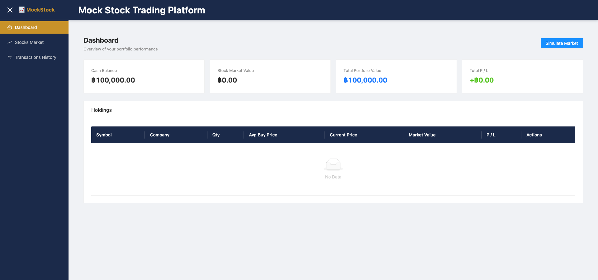
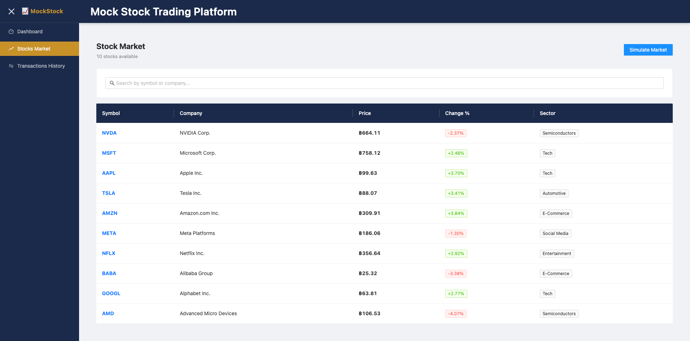
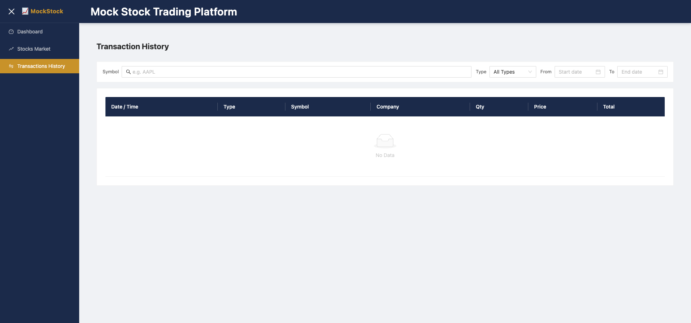
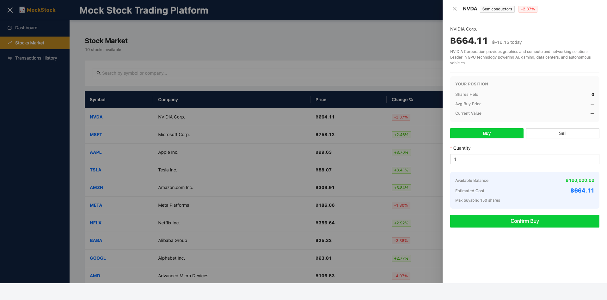
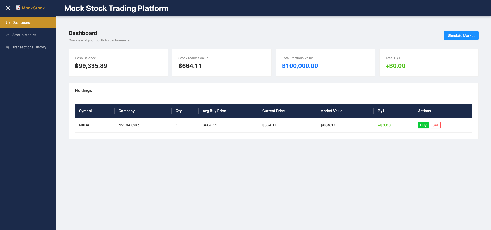
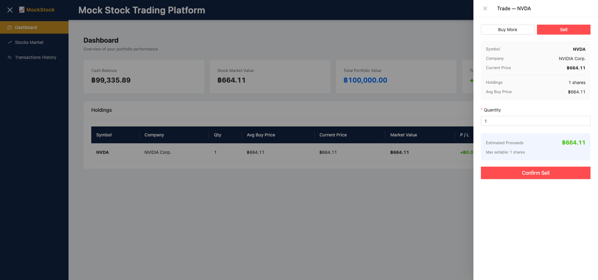

# Mock Stock Trading Platform

ระบบจำลองการซื้อขายหุ้นแบบ Full-Stack ที่ผู้ใช้เริ่มต้นด้วยเงิน ฿100,000 สามารถซื้อ/ขายหุ้นจำลอง ติดตามพอร์ตการลงทุน และจำลองการเปลี่ยนแปลงราคาตลาดได้

---

## ภาพรวมโปรเจกต์

ระบบรองรับผู้ใช้คนเดียว เริ่มต้นด้วยเงิน ฿100,000 สามารถซื้อ/ขายหุ้นจำลอง 10 ตัว ติดตามพอร์ต กำไร/ขาดทุน จำลองราคาตลาด ±5% และดูประวัติการซื้อขาย ข้อมูลทั้งหมดเก็บใน PostgreSQL

---

## Tech Stack

| Layer    | Technology                                                         |
|----------|--------------------------------------------------------------------|
| Frontend | Angular 18 (Standalone Components), TypeScript, ng-zorro-antd 18 (Ant Design) |
| Backend  | Java 17, Spring Boot 3.2, Maven, Lombok, Swagger (SpringDoc OpenAPI) |
| Storage  | PostgreSQL 16                                                      |

---

## Features ที่ทำเสร็จแล้ว

- [x] **Dashboard** — แสดงเงินสดคงเหลือ, มูลค่าหุ้นรวม, มูลค่าพอร์ตรวม, กำไร/ขาดทุน, ตารางหุ้นที่ถือ
- [x] **Stock List** — รายการหุ้น 10 ตัว, ค้นหาจาก Symbol/ชื่อบริษัท, เรียงลำดับคอลัมน์ได้
- [x] **Stock Detail** — ราคาปัจจุบัน, Daily Change, รายละเอียดบริษัท, ข้อมูลที่ถือ, ฟอร์มซื้อ/ขาย
- [x] **Buy Stock** — Validation ครบ (จำนวน, เงินสด), คำนวณ Avg Buy Price แบบ Weighted Average
- [x] **Sell Stock** — Validation ครบ (จำนวน, ตรวจสอบหุ้นที่ถือ), Avg Buy Price ไม่เปลี่ยนเมื่อขาย
- [x] **Transaction History** — ราคาล็อกตอนทำรายการ, เรียงใหม่ไปเก่า, Badge BUY/SELL
- [x] **Simulate Market** — สุ่มราคา ±5%, อัปเดต Daily Change %, พอร์ตคำนวณใหม่อัตโนมัติ
- [x] **Unit Tests** — Backend test cases ครอบคลุม buy/sell/simulate logic
- [x] **PostgreSQL** — เก็บข้อมูลถาวร, ข้อมูลคงอยู่เมื่อ restart
- [x] **UI ที่ใช้งานง่าย** — Ant Design components, Responsive layout, Toast notifications
- [x] **API Response สม่ำเสมอ** — `{ success, data, message }` ทุก endpoint
- [x] **Service Layer** — แยก Business logic ออกเป็น 5 services อิสระ (MarketService, OrderService, PortfolioService, StockService, TransactionService)
- [x] **Lombok** — ลด boilerplate ใน Entity และ DTO ด้วย `@Getter @Setter @NoArgsConstructor @AllArgsConstructor`
- [x] **Swagger / OpenAPI** — UI ที่ `/swagger-ui.html` สำหรับ test API โดยไม่ต้องใช้ Postman
- [x] **DTO refactor** — แยก `dto/request/` และ `dto/response/` พร้อม static `from()` factory method
- [x] **Exception Handling** — `GlobalExceptionHandler` ดักจับ error ทั่วระบบ คืน HTTP status ที่ถูกต้องอัตโนมัติ

## Features ที่ยังไม่เสร็จ

- [ ] Authentication / Multi-user
- [ ] Real-time price update (WebSocket)
- [ ] กราฟแสดงประวัติราคา
- [ ] เชื่อมต่อ API ตลาดหุ้นจริง

---

## Architecture Overview

โปรเจกต์นี้ใช้ **Layered Architecture** แบ่งออกเป็น 4 ชั้น:

```
[HTTP Request]
      ↓
  Controller          ← รับ request, validate input เบื้องต้น, คืน ResponseEntity
      ↓
   Service            ← Business logic ทั้งหมด, throw Exception เมื่อ rule ไม่ผ่าน
      ↓
  Repository          ← query database
      ↓
  PostgreSQL          ← เก็บข้อมูลจริง
```

### Exception Handling Flow

```
Service → throw IllegalArgumentException("Insufficient cash")
                      ↓
        GlobalExceptionHandler ดักจับ (@ControllerAdvice)
                      ↓
        คืน HTTP 400 + { "success": false, "message": "Insufficient cash" }
```

`GlobalExceptionHandler` ทำงานอัตโนมัติ — ไม่ต้องเขียน `try-catch` ใน Controller เลย

| Exception | HTTP Status | กรณีที่เกิด |
|-----------|------------|------------|
| `IllegalArgumentException` | 400 Bad Request | validation ไม่ผ่าน เช่น เงินไม่พอ, จำนวนไม่ถูก |
| `MethodArgumentTypeMismatchException` | 400 Bad Request | ส่ง type ผิดใน path variable |
| `Exception` (ทั่วไป) | 500 Internal Server Error | error ที่ไม่คาดคิด |

---

## วิธีติดตั้ง

### สิ่งที่ต้องมีก่อน

- Java 17+
- Maven 3.8+ (หรือใช้ `./mvnw` ที่มีให้แล้ว)
- Node.js 18+ และ npm
- PostgreSQL 16 (local)

---

## วิธี Run Backend

ต้องมี PostgreSQL รันอยู่ก่อน สร้าง database ด้วย:

```sql
CREATE DATABASE mockstock;
CREATE USER mockstock WITH PASSWORD 'mockstock';
GRANT ALL PRIVILEGES ON DATABASE mockstock TO mockstock;
```

หรือรัน PostgreSQL ด้วย Docker เพียงอย่างเดียว:

```bash
docker run -d --name mockstock-pg \
  -e POSTGRES_DB=mockstock -e POSTGRES_USER=mockstock -e POSTGRES_PASSWORD=mockstock \
  -p 5432:5432 postgres:16-alpine
```

จากนั้น run backend:

```bash
cd backend
./mvnw spring-boot:run
```

API server จะเปิดที่ **http://localhost:8080**

### วิธี Run Test (Backend)

```bash
cd backend
./mvnw test
```

ดูผลแบบ verbose (แนะนำ):

```bash
./mvnw test -Dsurefire.useFile=false
```

ผลที่ควรได้:

```
Tests run: 15, Failures: 0, Errors: 0, Skipped: 0
BUILD SUCCESS
```

> **หมายเหตุ:** Test ไม่ต้องเชื่อมต่อ PostgreSQL — ใช้ Mockito mock ทุก repository ดังนั้นรันได้ทันทีโดยไม่ต้องเปิด database

---

### Test Coverage — ครอบคลุมอะไรบ้าง

ไฟล์ test อยู่ที่ `backend/src/test/java/com/mockstock/service/`

#### `OrderServiceTest` (12 test cases)

| กลุ่ม | Test | สิ่งที่ตรวจสอบ |
|-------|------|----------------|
| **BUY ✅** | `buyStock_success` | เงินหักถูก, หุ้น save, transaction บันทึก |
| **BUY ✅** | `buyStock_avgPriceRecalculated` | Weighted avg price คำนวณถูกเมื่อซื้อซ้ำ |
| **BUY ❌** | `buyStock_insufficientCash` | throw เมื่อเงินไม่พอ, ไม่มีการ save ใดๆ |
| **BUY ❌** | `buyStock_invalidQuantityZero` | throw เมื่อ quantity = 0 |
| **BUY ❌** | `buyStock_invalidQuantityNegative` | throw เมื่อ quantity ติดลบ |
| **BUY ❌** | `buyStock_stockNotFound` | throw เมื่อ symbol ไม่มีในระบบ |
| **SELL ✅** | `sellStock_success` | เงินเพิ่มถูก, จำนวนหุ้นลด, transaction บันทึก |
| **SELL ✅** | `sellStock_holdingDeletedWhenAllSold` | ลบ portfolio item เมื่อขายหมด |
| **SELL ❌** | `sellStock_exceedQuantity` | throw เมื่อขายเกินจำนวนที่ถือ |
| **SELL ❌** | `sellStock_notHeld` | throw เมื่อไม่มีหุ้นตัวนั้นในพอร์ต |
| **SELL ❌** | `sellStock_invalidQuantityZero` | throw เมื่อ quantity = 0 |
| **SELL ❌** | `sellStock_stockNotFound` | throw เมื่อ symbol ไม่มีในระบบ |

#### `MarketServiceTest` (2 test cases)

| Test | สิ่งที่ตรวจสอบ |
|------|----------------|
| `simulateMarket_pricesWithinBounds` | ราคาใหม่อยู่ในช่วง ±5%, ราคาต่ำสุด 0.01 |
| `simulateMarket_fieldsUpdated` | `previousPrice` และ `dailyChange` อัปเดตถูกต้อง |

#### `TransactionServiceTest` (1 test case)

| Test | สิ่งที่ตรวจสอบ |
|------|----------------|
| `getTransactions_newestFirst` | คืน transaction เรียงจากใหม่ไปเก่า |

---

### ลำดับ Test ที่แนะนำ (จากง่ายไปซับซ้อน)

```
1. TransactionServiceTest    — ง่ายที่สุด: ทดสอบ query + ordering
2. MarketServiceTest         — ทดสอบ price randomization + field update
3. OrderServiceTest (BUY)    — ทดสอบ buy logic: happy path → validation → error
4. OrderServiceTest (SELL)   — ทดสอบ sell logic: happy path → validation → error
```

---

## วิธี Run Frontend

```bash
cd frontend
npm install
npm run dev   # หรือ npm start
```

UI จะเปิดที่ **http://localhost:3000**

> ต้องเปิด Backend ก่อน จึงจะโหลดข้อมูลได้

---

## วิธี Run ด้วย Docker Compose

### เริ่มต้น

```bash
docker-compose up --build
```

### หยุด / ลบ containers

```bash
docker-compose down          # หยุด และลบ containers (เก็บ volume ไว้)
docker-compose down -v       # หยุด + ลบ containers + ลบ volume (ข้อมูลหาย)
```

### ดู logs

```bash
docker-compose logs -f               # ทุก service
docker-compose logs -f backend       # เฉพาะ backend
docker-compose logs -f postgres      # เฉพาะ database
```

### เข้าไปใน container

```bash
docker exec -it mock-stock-backend bash
docker exec -it mock-stock-postgres psql -U mockstock -d mockstock
```

| Service  | URL                              | หมายเหตุ                        |
|----------|----------------------------------|---------------------------------|
| Frontend | http://localhost:3000            | Angular เสิร์ฟด้วย nginx        |
| Backend  | http://localhost:8080            | Spring Boot REST API            |
| Swagger  | http://localhost:8080/swagger-ui.html | Interactive API docs        |
| Database | localhost:5432                   | PostgreSQL (user/pass: mockstock) |

---

## API Endpoints

| Method | Endpoint            | คำอธิบาย                              |
|--------|---------------------|---------------------------------------|
| GET    | /stocks             | ดูรายการหุ้นทั้งหมด                  |
| GET    | /stocks/{symbol}    | ดูรายละเอียดหุ้น + ข้อมูลที่ถือ      |
| GET    | /portfolio          | ดูสรุปพอร์ตการลงทุน                  |
| POST   | /orders/buy         | ซื้อหุ้น `{ symbol, quantity }`       |
| POST   | /orders/sell        | ขายหุ้น `{ symbol, quantity }`        |
| GET    | /transactions       | ดูประวัติการซื้อขาย (ใหม่สุดก่อน)   |
| POST   | /market/simulate    | จำลองการเปลี่ยนแปลงราคา ±5%         |

### รูปแบบ API Response

ทุก endpoint ตอบกลับในรูปแบบเดียวกัน:

```json
{
  "success": true,
  "data": { ... },
  "message": "ok"
}
```

กรณี error จะได้ `"success": false` พร้อม `"message"` อธิบายสาเหตุ

### ตัวอย่าง Request/Response

**ซื้อหุ้น `POST /orders/buy`**

Request:
```json
{ "symbol": "AAPL", "quantity": 5 }
```

Response (success):
```json
{
  "success": true,
  "message": "Buy order executed successfully",
  "data": {
    "cash": 94250.00,
    "stockMarketValue": 5750.00,
    "totalValue": 100000.00,
    "unrealizedPnL": 0.00,
    "holdings": [
      { "symbol": "AAPL", "quantity": 5, "avgBuyPrice": 1150.00, "currentPrice": 1150.00, "marketValue": 5750.00, "unrealizedPnL": 0.00 }
    ]
  }
}
```

Response (error — เงินไม่พอ):
```json
{
  "success": false,
  "data": null,
  "message": "Exceeds maximum buyable quantity. Max: 202, Requested: 300"
}
```

**ขายหุ้น `POST /orders/sell`**

Request:
```json
{ "symbol": "AAPL", "quantity": 2 }
```

**จำลองตลาด `POST /market/simulate`**

ไม่ต้องส่ง body — ราคาหุ้นทุกตัวจะเปลี่ยนแบบสุ่ม ±5%

---

## โครงสร้างโปรเจกต์

```
Mock_Stock_Trading_Platform/
├── backend/
│   ├── mvnw / mvnw.cmd                 # Maven Wrapper
│   ├── pom.xml
│   └── src/
│       ├── main/java/com/mockstock/
│       │   ├── MockStockApplication.java
│       │   ├── config/
│       │   │   ├── CorsConfig.java
│       │   │   └── SwaggerConfig.java          # OpenAPI bean → /swagger-ui.html
│       │   ├── entity/                         # Stock, PortfolioItem, Transaction, UserState
│       │   ├── dto/
│       │   │   ├── ApiResponse.java            # wrapper { success, data, message }
│       │   │   ├── request/OrderRequest.java
│       │   │   └── response/                   # HoldingItem, PortfolioResponse, StockDetailResponse
│       │   ├── repository/
│       │   ├── service/
│       │   │   ├── MarketService.java          # สุ่มราคา ±5% ทุกหุ้น
│       │   │   ├── OrderService.java           # buy/sell logic, weighted avg price
│       │   │   ├── PortfolioService.java       # คำนวณ portfolio summary
│       │   │   ├── StockService.java           # ดึงข้อมูลหุ้น
│       │   │   └── TransactionService.java     # ดึงประวัติการซื้อขาย
│       │   ├── controller/                     # StockController, PortfolioController,
│       │   │                                   # OrderController, TransactionController, MarketController
│       │   └── exception/
│       │       └── GlobalExceptionHandler.java # @ControllerAdvice ดักจับ exception ทั่วระบบ
│       ├── main/resources/
│       │   └── application.properties
│       └── test/java/com/mockstock/service/
│           ├── MarketServiceTest.java
│           ├── OrderServiceTest.java
│           └── TransactionServiceTest.java
│
├── frontend/
│   ├── angular.json
│   ├── tsconfig.json
│   └── src/
│       ├── environments/                       # environment.ts, environment.prod.ts
│       └── app/
│           ├── app.config.ts                  # provideHttpClient, provideRouter, provideAnimations
│           ├── app.routes.ts                  # Lazy-loaded routes
│           ├── core/
│           │   ├── models/index.ts            # TypeScript interfaces ทั้งหมด
│           │   └── services/
│           │       ├── api.service.ts         # Base HttpClient (unwrap ApiResponse<T>)
│           │       ├── stock.service.ts
│           │       ├── portfolio.service.ts
│           │       ├── order.service.ts
│           │       ├── transaction.service.ts
│           │       └── market.service.ts
│           ├── pages/
│           │   ├── dashboard/                 # ภาพรวมพอร์ต + ตารางหุ้นที่ถือ
│           │   ├── stock-list/                # รายการหุ้นพร้อมค้นหา/เรียงลำดับ
│           │   ├── stock-detail/              # ฟอร์มซื้อ/ขาย + ข้อมูลที่ถือ
│           │   └── transactions/             # ประวัติการซื้อขาย
│           └── shared/
│               └── layout/                    # Sidebar layout (NzLayoutModule)
│
├── docker-compose.yml
├── .gitignore
├── README.md
└── AI_USAGE.md
```

---

## ออกแบบข้อมูล (PostgreSQL)

| ตาราง            | Primary Key | คำอธิบาย                                  |
|-----------------|-------------|-------------------------------------------|
| `stocks`        | `symbol`    | ราคาปัจจุบัน, previous, daily change, sector |
| `user_state`    | `id` (=1)   | เงินสดของผู้ใช้                            |
| `portfolio_items`| `symbol`   | จำนวนหุ้น + avg buy price                 |
| `transactions`  | `id` (UUID) | ประวัติการซื้อขาย เรียงตาม timestamp DESC  |

---

## Business Logic สำคัญ

### Weighted Average Buy Price

เมื่อซื้อหุ้นเดิมเพิ่ม ราคาต้นทุนเฉลี่ยจะคำนวณใหม่:

```
newAvgPrice = (เดิมถือ × ราคาเดิม) + (ซื้อใหม่ × ราคาใหม่)
              ─────────────────────────────────────────────
                         จำนวนรวมทั้งหมด
```

เช่น ถือ AAPL 10 หุ้น @ ฿1,000 แล้วซื้อเพิ่ม 5 หุ้น @ ฿1,200:
```
newAvg = (10×1000 + 5×1200) / 15 = 16000/15 = ฿1,066.67
```

### Simulate Market

ทุกครั้งที่กด Simulate ราคาหุ้น **ทุกตัว** จะเปลี่ยนแบบสุ่มระหว่าง -5% ถึง +5%  
ราคาต่ำสุดที่เป็นไปได้คือ ฿0.01 (ไม่ติดลบ)

---

## Swagger / OpenAPI

เข้าถึงได้ที่ **http://localhost:8080/swagger-ui.html** เมื่อ backend รันอยู่

ใช้ Swagger เพื่อ:
- ดู request/response schema ทุก endpoint
- ทดสอบ API ได้ทันทีโดยไม่ต้องใช้ Postman
- ดูตัวอย่าง error response

---

## สิ่งที่จะปรับปรุงถ้ามีเวลาเพิ่ม

- เพิ่ม `@Version` + Optimistic locking บน `user_state` เพื่อป้องกัน Race condition
- เพิ่มกราฟราคาหุ้น (เก็บ snapshot ทุกครั้งที่ Simulate → แสดงด้วย ng2-charts)
- เพิ่ม Real-time update ด้วย WebSocket / SSE
- เพิ่มระบบ Authentication ด้วย Spring Security + JWT
- เขียน Frontend unit test ด้วย Angular Testing Library + Jasmine
- เขียน E2E test ด้วย Cypress
- เพิ่ม `ResourceNotFoundException` สำหรับ 404 แทนการคืน `null`






